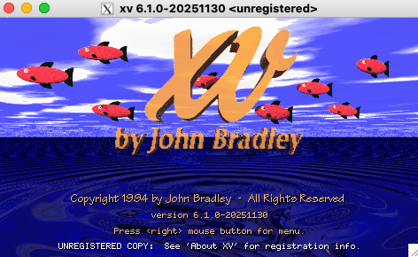

# xv-macos



This repository provides a "clean-room" environment for building the classic image viewer and editor, XV, on macOS.
It aims to consolidate the original XV source code, essential patches, and a build script for a streamlined macOS
development experience.

WARNING! This repository / project is only out of pure nostalgia.

The _real_ work porting and updating xv is here:
  https://github.com/jasper-software/xv

Me? I've using XV since the 90's and always wanted to get around being able to recompile
this [xv-3.10a.tar.gz](https://web.archive.org/web/20231213012618/ftp://ftp.cis.upenn.edu/pub/xv/xv-3.10a.tar.gz)
archive i've been carrying around since.

Thanks GEMINI for the help!

## Quickstart

`./build_macos.sh`

## Project Contents:

*   **Original XV Source:** The patched 'Jumbo' XV 3.10a tree (`xv-3.10a-patched.tar.gz`).
*   **Patch:** A MacOS patch to make this tree compile clean: `macos-compile.path`
*   **CMake config:** A `CMakeLists.txt` file for configuring the build process.
*   **Build Script:** A shell script (`./build_macos.sh`) to automate the build on macOS.
*   **The final source tree**: `xv-3.10a` contains the expected output of the script run, for reference.
*   **Documentation:** Information about XV's origin (`xv_origin.txt`) and this repository's README.
*   **License:** XV's shareware license information (`LICENSE`).

This source tree has been heavily prepared by GEMINI-CLI under my supervision.


## Building XV on macOS:

Follow these steps to build XV from this repository:

1.  **Prerequisites:** Ensure you have Homebrew installed. If not, install it from [brew.sh](https://brew.sh/).
2.  **Dependencies:** Run the build script, which will handle installing necessary dependencies (XQuartz, libjpeg-turbo, libtiff, libpng, jasper).
3.  **Build:** Execute the build script.

```bash
# Clone this repository (if you haven't already)
# git clone git@github.com:skal65535/xv-macos.git xv-macos

# Navigate to the repository directory
# cd xv-macos

# Run the build script
./scripts/build_macos.sh
```

-> `build/` should contain the 'xv' binaries.

## XV License:

XV is distributed under a shareware license for personal use. Commercial, government, and institutional users are
required to register their copies. Please refer to the `LICENSE` file for full details.

## References

  * Greg Roelofs' [Jumbo patches](http://gregroelofs.com/greg_xv.html). This is the starting point.
  * Modern 'xv' version (with WebP support!): [github.com/jasper-software/xv](https://github.com/jasper-software/xv) . Use this one!
  * porting xv on Ubuntu (archive): [building-xv-on-ubuntu](https://web.archive.org/web/20230218222525/https://groupbcl.ca/blog/posts/2019/building-xv-on-ubuntu)
  * [original ftp site](https://web.archive.org/web/20231213012618/ftp://ftp.cis.upenn.edu/pub/xv/) at UPenn
